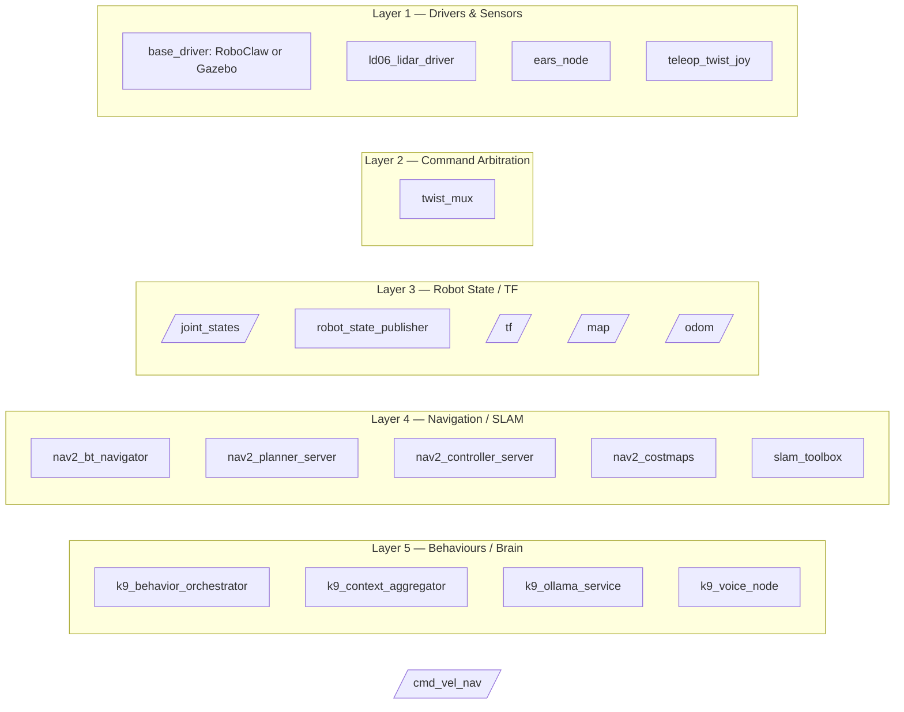

# K9 System ROS 2 Nodes
These ROS 2 nodes work together to create a real robot K9 that can do everything from:
* playing chess
* following you around the house
* to telling you:
   * the best time to go for a walk
   * when your next Google Calendar appointment is
   * a list of tasks in the garden based on weather and month



## Back Lights and Side Screen
A node that:
* turns lights on or off (back_lights_on; back_lights_off)
* turns K9's side screen on or off (Trigger)
* set custom patterns of back lights (LightsControl)
* retrieves the status of K9's back panel switches (SwitchState)

Use the `/back_lights_cmd` topic to send instructions to change the pattern of lights.  Current patterns include: original, colour, diagonal, two, three, four, six, red, green, blue, spiral, chase_v, chase_h, cols, rows, on, off. Speeds include fastest, fast, normal, slow, slowest.

```
ros2 service call /back_lights_on std_srvs/srv/Trigger`
ros2 topic pub --once /back_lights_cmd std_msgs/msg/String "{data: 'blue'}"
```

## Ears
A node that controls the LIDAR ears on K9, specifically via a Trigger it can:
* stop the ears (ears_stop)
* make them scan (ears_scan)
* make them move quickly (ears_fast)
* make them move as if he is thinking (ears_think)
* put them in follow mode (ears_follow_read)
* put them in safe rotate mode (ears_safe_rotate)

## Eyes and Tail
A node that controls the servo controller in K9; this means it controls both the eyes and the tail.
* For the face panel on K9. It subscribes to the 'is_talking' topic to automatically temporarily brighten the lights when K9 is talking. It also responds to:
    * set brightness (eyes_set_level)
    * get brightness (eyes_get_brightness)
    * turn on (tv_on)
    * turn off (tv_off)
* For the tail, it responds to Triggers that enables the tail to:
    * Wag horizontally (tail_wag_h)
    * Wag vertically (tail_wag v)
    * Cemtre the tail (tail_centre)
    * Raise the tail (tail_up)
    * Lower the tail (tail_down)

```
ros2 service call /tail_wag_v std_srvs/srv/Trigger
ros2 service call /eyes_on std_srvs/srv/Trigger
ros2 service call /eyes_set_level k9_interfaces_pkg/srv/SetBrightness "{level: 0.01}"
```

## Voice

This bundle converts the Piper voice node to a cancellable, priority-aware ROS 2 action server.

### Files

- `k9_interfaces_pkg/action/SpeakText.action`
- `k9_system_pkg/k9_system_pkg/voice_action_node.py`
- build/package snippets for both packages

### Install

Copy the action file:

```bash
cp k9_interfaces_pkg/action/SpeakText.action \
  ~/k9_ws/src/k9_interfaces_pkg/action/SpeakText.action
```

Copy the node:

```bash
cp k9_system_pkg/k9_system_pkg/voice_action_node.py \
  ~/k9_ws/src/k9_system_pkg/k9_system_pkg/voice_action_node.py
chmod +x ~/k9_ws/src/k9_system_pkg/k9_system_pkg/voice_action_node.py
```

Apply the supplied CMakeLists, package.xml and setup.py additions, then build interfaces first:

```bash
cd ~/k9_ws
source /opt/ros/jazzy/setup.bash
colcon build --symlink-install --packages-select k9_interfaces_pkg
source install/setup.bash
colcon build --symlink-install --packages-select k9_system_pkg
source install/setup.bash
```

Run:

```bash
ros2 run k9_system_pkg voice_action
```

### Test the action

Normal queued speech:

```bash
ros2 action send_goal /voice/speak \
  k9_interfaces_pkg/action/SpeakText \
  "{text: 'Affirmative. Voice action server operational.', owner: 'test', priority: 50, interrupt_lower_priority: false, clear_lower_priority: false}" \
  --feedback
```

High-priority replacement speech:

```bash
ros2 action send_goal /voice/speak \
  k9_interfaces_pkg/action/SpeakText \
  "{text: 'Emergency interruption test.', owner: 'test', priority: 200, interrupt_lower_priority: true, clear_lower_priority: true}" \
  --feedback
```

Use `Ctrl+C` in the action client to request cancellation.

Monitor eye-animation topics:

```bash
ros2 topic echo /voice/is_talking
ros2 topic echo /voice/rms_level
ros2 topic hz /voice/rms_level
```

Legacy interfaces remain available during migration:

```bash
ros2 topic pub --once /voice/tts_input std_msgs/msg/String \
  "{data: 'Legacy queued speech test.'}"

ros2 service call /speak_now k9_interfaces_pkg/srv/Speak \
  "{text: 'Legacy immediate speech test.'}"

ros2 service call /cancel_speech k9_interfaces_pkg/srv/CancelSpeech "{}"
```

### Behaviour

- One utterance owns the physical speaker at a time.
- Queued goals are ordered by priority, then FIFO within the same priority.
- `interrupt_lower_priority=true` pre-empts an active goal of lower or equal priority.
- `clear_lower_priority=true` removes queued goals of lower or equal priority.
- Client cancellation returns a cancelled action result.
- Server-side pre-emption aborts the replaced action with `interrupted=true`.
- `/voice/is_talking` remains true across a clean pre-emption when the replacement is already queued.
- `/is_talking` is also published by default for compatibility with the current eyes node; set `publish_legacy_is_talking:=false` after migrating it to `/voice/is_talking`.
- `/voice/rms_level` is published for every played Piper chunk and reset to zero at the end.

### Recommended BT goal settings

General conversation:

```yaml
owner: dialogue
priority: 100
interrupt_lower_priority: true
clear_lower_priority: true
```

Chess setup question:

```yaml
owner: chess_setup
priority: 80
interrupt_lower_priority: false
clear_lower_priority: false
```

Low-priority chess commentary:

```yaml
owner: chess_commentary
priority: 30
interrupt_lower_priority: false
clear_lower_priority: false
```

Emergency handling should cancel the current action goal and also call `/cancel_speech` to clear any unrelated queued legacy/action requests.

## Hotword
A node that is activated by a service call and then listens for the "canine" hotword. When it hears that word, it closes itself down and publishes to the 'hotword_detected' topic.

## Calendar
A node that works with Google Calendar. It offers two services that announce the next appointment or the whole day's worth of appointments - or if there is an appointment in the next five minutes it will provide a reminder. Uses the topic subscribed to by the Voice node to make the announcements verbal.

## K9 Client
Provides a simple set of Python classes that wrap these ROS2 Nodes. The objects and interfaces are generally identical to
those used on the non-ROS version of K9 and can be used to write simple programs without knowledge of ROS.

## Context
This node aggregates information received from other nodes and publishes a context message.

## Ollama Wrap
This node wraps generative LLMs so that a message in English can be turned into a phrase that K9 might say.

