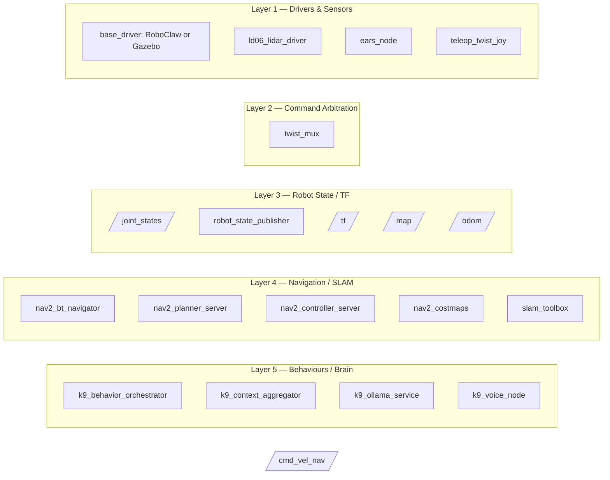

# K9 System ROS 2 Nodes
These ROS 2 nodes work together to create a real robot K9 that can do everything from:
* playing chess
* following you around the house
* to telling you:
   * the best time to go for a walk
   * when your next Google Calendar appointment is
   * a list of tasks in the garden based on weather and month


```mermaid
flowchart LR
  %% =========================
  %% Layer 5 — Behaviours / Brain
  %% =========================
  subgraph L5["Layer 5 — Behaviours / Brain"]
    BEH[k9_behavior_orchestrator]
    CTX[k9_context_aggregator]
    LLM[k9_ollama_service]
    VOICE[k9_voice_node]
  end

  %% =========================
  %% Layer 4 — Navigation & SLAM
  %% =========================
  subgraph L4["Layer 4 — Navigation / SLAM"]
    BT[nav2_bt_navigator]
    PL[nav2_planner_server]
    CTRL[nav2_controller_server]
    CM[nav2_costmaps]
    SLAM[slam_toolbox]
  end

  %% =========================
  %% Layer 3 — Robot State & TF
  %% =========================
  subgraph L3["Layer 3 — Robot State / TF"]
    JS[/joint_states/]
    RSP[robot_state_publisher]
    TF[/tf/]
    MAP[/map/]
    ODOM[/odom/]
  end

  %% =========================
  %% Layer 2 — Command Arbitration
  %% =========================
  subgraph L2["Layer 2 — Command Arbitration"]
    MUX[twist_mux]
  end

  %% =========================
  %% Layer 1 — Drivers & Sensors
  %% =========================
  subgraph L1["Layer 1 — Drivers & Sensors"]
    BASE[base_driver: RoboClaw or Gazebo]
    LD06[ld06_lidar_driver]
    EARS[ears_node]
    JOY[teleop_twist_joy]
  end

  %% =========================
  %% Key Topics
  %% =========================
  CMDNAV[/cmd_vel_nav/]
```

## Back Lights and Side Screen
A node that:
* turns lights on or off (back_lights_on; back_lights_off)
* turns K9's side screen on or off (Trigger)
* set custom patterns of back lights (LightsControl)
* retrieves the status of K9's back panel switches (SwitchState)

Use the `/back_lights_cmd` topic to send instructions to change the pattern of lights.  Current patterns include: original, colour, diagonal, two, three, four, six, red, green, blue, spiral, chase_v, chase_h, cols, rows, on, off. Speeds include fastest, fast, normal, slow, slowest.

```
ros2 service call /back_lights_on std_srvs/srv/Trigger`
ros2 topic pub --once /back_lights_cmd std_msgs/msg/String "{data: 'blue'}"
```

## Ears
A node that controls the LIDAR ears on K9, specifically via a Trigger it can:
* stop the ears (ears_stop)
* make them scan (ears_scan)
* make them move quickly (ears_fast)
* make them move as if he is thinking (ears_think)
* put them in follow mode (ears_follow_read)
* put them in safe rotate mode (ears_safe_rotate)

## Eyes and Tail
A node that controls the servo controller in K9; this means it controls both the eyes and the tail.
* For the face panel on K9. It subscribes to the 'is_talking' topic to automatically temporarily brighten the lights when K9 is talking. It also responds to:
    * set brightness (eyes_set_level)
    * get brightness (eyes_get_brightness)
    * turn on (tv_on)
    * turn off (tv_off)
* For the tail, it responds to Triggers that enables the tail to:
    * Wag horizontally (tail_wag_h)
    * Wag vertically (tail_wag v)
    * Cemtre the tail (tail_centre)
    * Raise the tail (tail_up)
    * Lower the tail (tail_down)

```
ros2 service call /tail_wag_v std_srvs/srv/Trigger
ros2 service call /eyes_on std_srvs/srv/Trigger
ros2 service call /eyes_set_level k9_interfaces_pkg/srv/SetBrightness "{level: 0.01}"
```

## Voice

This node uses NeuTTS voice cloning to provide K9's voice

### What are the main functions?

Primary action:

    /voice/speak    k9_interfaces_pkg/action/SpeakText

Backwards compatibility:

    /voice/tts_input
    /speak_now
    /cancel_speech

State/animation:

    /voice/is_talking
    /is_talking              (optional legacy publication)
    /voice/rms_level


### NeuTTS configuration

Default deployment settings are the ones that tested well on the Orin NX:

    backbone:       neuphonic/neutts-air-q4-gguf
    backbone:       CUDA
    codec:          neuphonic/neucodec-onnx-decoder-int8
    codec device:   CPU
    streaming:      25 frames ~= 500 ms
    language:       model default
    seed:           random per utterance

The model is loaded once and remains resident.

A quiet startup warm-up is enabled, so K9's first real utterance should see
warm rather than cold CUDA-graph behaviour.

### Voice references

Set:

    voice_id: 0..999

For example voice_id 7 resolves to:

    <voice_dir>/007.txt
    <voice_dir>/k9_007.pt

voice_id 244 resolves to:

    <voice_dir>/244.txt
    <voice_dir>/k9_244.pt

The default voice_dir is:

    ~/tts_env/neutts/samples

Changing voice_id at runtime is supported:

    ros2 param set /k9_tts_node voice_id 42

The change is rejected if either 042.txt or k9_042.pt does not exist. An
utterance already active keeps the reference with which it started; the next
utterance uses the selected ID.

Reference files are cached, but modification times are checked, so replacing a
.pt or .txt file causes it to be reloaded automatically on the next use.

### Virtual environment

NeuTTS remains in its own venv. The default is the environment already used
during testing:

    ~/tts_env/neutts/.venv

The ROS executable is a bash launcher. It executes:

    $K9_NEUTTS_VENV/bin/python -m k9_system_pkg.voice_neutts_node

If K9's venv moves:

    export K9_NEUTTS_VENV=/some/other/.venv

The shell launching ROS must still source ROS 2 and the K9 workspace so the
venv Python inherits ROS's PYTHONPATH and AMENT_PREFIX_PATH:

    source /opt/ros/jazzy/setup.bash
    source ~/k9_ws/install/setup.bash

The launch file also has a neutts_venv argument.

Check the environment with:

    ./check_neutts_venv.sh

### Run

Default voice 000:

    ros2 launch k9_system_pkg voice_neutts.launch.py

Voice 042:

    ros2 launch k9_system_pkg voice_neutts.launch.py voice_id:=42

Explicit venv:

    ros2 launch k9_system_pkg voice_neutts.launch.py \
      voice_id:=42 \
      neutts_venv:=/home/hopkira/tts_env/neutts/.venv

Or with ros2 run:

    ros2 run k9_system_pkg voice_neutts --ros-args \
      --params-file \
      ~/k9_ws/src/k9_system_pkg/config/voice_neutts.yaml

### Test normal speech

    ros2 action send_goal /voice/speak \
      k9_interfaces_pkg/action/SpeakText \
      "{text: 'Affirmative. Voice systems are operational.', owner: 'test', priority: 50, interrupt_lower_priority: false, clear_lower_priority: false}" \
      --feedback

### Test high-priority pre-emption

Start a long low-priority utterance, then:

    ros2 action send_goal /voice/speak \
      k9_interfaces_pkg/action/SpeakText \
      "{text: 'Priority interruption.', owner: 'test', priority: 200, interrupt_lower_priority: true, clear_lower_priority: true}" \
      --feedback

The active pw-cat process is terminated immediately. NeuTTS may take up to the
current generation chunk to return control, after which the replacement starts.

### Test global cancellation

    ros2 service call /cancel_speech \
      k9_interfaces_pkg/srv/CancelSpeech "{}"

### Legacy speak_now

    ros2 service call /speak_now \
      k9_interfaces_pkg/srv/Speak \
      "{text: 'Affirmative, Master.'}"

### Observe state

    ros2 topic echo /voice/is_talking
    ros2 topic echo /voice/rms_level

### Streaming implementation

NeuTTS generation and playback are deliberately decoupled:

    NeuTTS infer_stream()
             |
             v
      bounded audio queue
             |
             v
      persistent pw-cat process
             |
             v
         PipeWire sink

This prevents a blocking audio write from stopping generation of the next
chunk. A single pw-cat process is kept open for the whole utterance, avoiding
gaps caused by starting a player for every chunk.

The node logs TTFA and synthesis RTF after every completed utterance.

## PipeWire

Raw mono 16-bit PCM is streamed to pw-cat at NeuTTS' 24 kHz sample rate.

The default target is automatic. To select a particular PipeWire sink, set
pipewire_target in voice_neutts.yaml to its node name or object serial.

## Notes

- Only voice_id is dynamically mutable. Model/backend/audio configuration is
  startup-only because NeuTTS is deliberately kept resident.
- The default language is intentionally left empty so NeuTTS-Air chooses its
  own trained default rather than forcing en-gb.
- seed=-1 means each utterance gets a fresh NeuTTS seed.
- 500 ms synthesis chunks are retained because the Orin tests showed much
  better post-first-chunk real-time margin than 300 ms or 200 ms.


## Intent

`k9_intent_pkg` subscribes to `/speech_to_text/text` and publishes a structured
`k9_interfaces_pkg/msg/IntentResult` on `/intent/result`.

It also publishes the intent name alone on `/intent/name` for command-line
testing.

The classifier is intentionally layered:

1. Context-specific interpretation, currently chess setup.
2. High-confidence executive command rules.
3. Conservative `GENERAL_CONVERSATION` fallback.

This prevents an uncertain sentence from unexpectedly moving the robot.

### IntentResult.msg

Fields in k9_interfaces:

- `text`
- `intent`
- `confidence`
- `requires_response`
- `parameters_json`
- `source`

### Current intents

- STOP_LISTENING
- PLAY_CHESS
- FOLLOW_ME
- COME_HERE
- STAY
- TURN_ABOUT
- SHOW_OFF
- CHESS_SETUP_ANSWER
- GENERAL_CONVERSATION

### Context topic

`/intent/context` is a temporary JSON String bridge until the Behaviour Tree
publishes the relevant context directly.

Example:

```json
{"chess_state":"SETUP","chess_setup_step":"WAIT_COLOUR"}
```

With that context, `White` becomes:

```text
intent: CHESS_SETUP_ANSWER
parameters_json: {"colour":"WHITE","field":"colour"}
```

A sentence such as `Why does white move first in chess?` remains
`GENERAL_CONVERSATION`, because it is not a valid colour-only setup answer.

### Test without STT

```bash
ros2 topic echo /intent/result
```

Then:

```bash
ros2 topic pub --once /speech_to_text/text   std_msgs/msg/String "{data: 'Could you come here please?'}"
```

Expected intent: `COME_HERE`.

```bash
ros2 topic pub --once /speech_to_text/text   std_msgs/msg/String "{data: 'What is the largest planet?'}"
```

Expected intent: `GENERAL_CONVERSATION`.

## Test chess context

```bash
ros2 topic pub --once /intent/context std_msgs/msg/String   "{data: '{"chess_state":"SETUP","chess_setup_step":"WAIT_COLOUR"}'}"
```

Then:

```bash
ros2 topic pub --once /speech_to_text/text   std_msgs/msg/String "{data: 'I will take black'}"
```

Expected:

- intent: `CHESS_SETUP_ANSWER`
- confidence: about `0.99`
- parameters_json contains `"colour":"BLACK"`

Clear context:

```bash
ros2 topic pub --once /intent/context   std_msgs/msg/String "{data: '{}'}"
```

### Behaviour

- One utterance owns the physical speaker at a time.
- Queued goals are ordered by priority, then FIFO within the same priority.
- `interrupt_lower_priority=true` pre-empts an active goal of lower or equal priority.
- `clear_lower_priority=true` removes queued goals of lower or equal priority.
- Client cancellation returns a cancelled action result.
- Server-side pre-emption aborts the replaced action with `interrupted=true`.
- `/voice/is_talking` remains true across a clean pre-emption when the replacement is already queued.
- `/is_talking` is also published by default for compatibility with the current eyes node; set `publish_legacy_is_talking:=false` after migrating it to `/voice/is_talking`.
- `/voice/rms_level` is published for every played Piper chunk and reset to zero at the end.

### Recommended BT goal settings

General conversation:

```yaml
owner: dialogue
priority: 100
interrupt_lower_priority: true
clear_lower_priority: true
```

Chess setup question:

```yaml
owner: chess_setup
priority: 80
interrupt_lower_priority: false
clear_lower_priority: false
```

Low-priority chess commentary:

```yaml
owner: chess_commentary
priority: 30
interrupt_lower_priority: false
clear_lower_priority: false
```

Emergency handling should cancel the current action goal and also call `/cancel_speech` to clear any unrelated queued legacy/action requests.

## Hotword
A node that listens for the "canine" or "kay nine" hotword. When it hears that word, it publishes to the 'hotword_detected' topic.

- The hotword node owns the CM108 microphone permanently.
- Audio is captured once as 16 kHz, mono, signed 16-bit PCM.
- Every captured frame is published on `/audio/raw`.
- Sherpa-ONNX receives the same samples directly, without ROS serialization.
- KWS is active only while `/audio/effective_state` is `WAITING_FOR_HOTWORD`.
- A detection publishes exactly one `std_msgs/Bool(True)` on `/hotword_detected`.
- The node then latches off until the effective audio state leaves
  `WAITING_FOR_HOTWORD` and later returns.
- The node never starts/stops STT and never changes conversation state.

### Hotword Python dependencies

Install these into THE SAME PYTHON ENVIRONMENT THAT RUNS ROS 2:

```bash
sudo apt install libasound2-dev python3-dev

python -m pip install \
  numpy \
  pyalsaaudio \
  sherpa-onnx \
  sherpa-onnx-bin
```
### Testing
Terminal 1:

```bash
ros2 run k9_system_pkg hotword \
  --ros-args \
  --params-file ~/k9_ws/src/k9_system_pkg/config/hotword.yaml
```

Terminal 2:

```bash
ros2 topic echo /hotword_detected
```

Terminal 3, verify PCM is flowing:

```bash
ros2 topic hz /audio/raw
```

With `frame_ms: 20`, expect approximately 50 messages/second.

Say "K9" or "canine". The hotword topic should produce exactly one:

```text
data: true
```

The node is now latched, by design. You can re-arm manually before the BT is connected:

```bash
ros2 topic pub --once /audio/effective_state std_msgs/msg/String \
  "{data: 'LISTENING'}"

ros2 topic pub --once /audio/effective_state std_msgs/msg/String \
  "{data: 'WAITING_FOR_HOTWORD'}"
```

Now another "K9" should generate one more event.

No direct service call from HotwordNode to SpeechToText is required.

## Calendar
A node that works with Google Calendar. It offers two services that announce the next appointment or the whole day's worth of appointments - or if there is an appointment in the next five minutes it will provide a reminder. Uses the topic subscribed to by the Voice node to make the announcements verbal.

## K9 Client
Provides a simple set of Python classes that wrap these ROS2 Nodes. The objects and interfaces are generally identical to
those used on the non-ROS version of K9 and can be used to write simple programs without knowledge of ROS.

## Context
This node aggregates information received from other nodes and publishes a context message.

## Ollama Wrap
This node wraps generative LLMs so that a message in English can be turned into a phrase that K9 might say.

